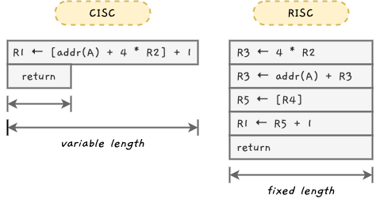
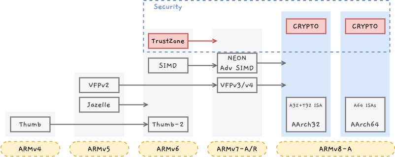
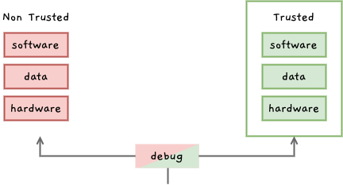

ARM에서는 프로세서를 설계하여 반도체 제조사와 SoC 제조사에 Hard Macrocell 또는 Synthesizable core로 제공합니다. 반도체 제조사와 SoC 제조사에서는 제공받은 ARM core에 주변 장치를 추가하여 SoC를 만들어 판매하거나 자체 제품에 사용합니다. [^1]

## ARM 아키텍처
ARM 아키텍처(ARM architecture)는 RISC 프로세서로 구조가 단순하고 전력 소모량이 낮아 임베디드 시스템에 주로 사용됩니다. ARM 아키텍처에는 A, R, M 세가지 프로파일이 있으며, 아래와 같은 특징을 가집니다.

- `A-Profile` (Applications): 고성능, 고속연산 / 리눅스, 윈도우 등 복잡한 OS용
- `R-Profile` (Real-Time): 실시간 시스템용 / 네트워크 장비, 임베디드 제어 시스템 등
- `M-Profile` (Microcontroller): 저비용, 저전력 / IoT

스마트폰을 예를 들어 살펴보면, 안드로이드와 같은 OS 구동에는 `A-profile` 프로세서가 쓰이며 연결성을 제공하기 위한 셀룰러 모뎀에는 `R-profile` 프로세서가 쓰입니다. 또한 시스템 전력 관리 등에는 `M-profile` 프로세서가 포함됩니다.

### CISC (Complex Instruction Set Computer)와 RISC (Reduced Instruction Set Computer)

컴퓨터 아키텍처는 CISC와 RISC 명령어 구조로 나뉩니다. [^2] CISC는 복잡한 명령어 집합을 갖는 CPU 아키텍처로 명령어 길이가 가변적이기 때문에 메모리를 비교적 적게 사용하여 많은 정보를 처리할 수 있어 생산성이 높습니다. 그러나 구조가 복잡하고 소비 전력이 많기 때문에 데스크탑 컴퓨터 등 고성능 범용 컴퓨팅 장치에 많이 사용됩니다.

ARM 프로세서에서 쓰이는 RISC는 CPU 명령어의 개수를 줄여 하드웨어 구조를 좀 더 간단하게 만드는 방식으로 명령어의 길이가 일정하여 해석과 판단을 단순하게 처리할 수 있습니다. 생산성은 비교적 낮지만 정보 처리 효율이 높고 소비 전력이 적기 때문에 임베디드 시스템에 많이 사용됩니다.

### ARM 아키텍처 버전
ARM 프로세서는 시장의 요구에 따라 아키텍처가 지속적으로 발전했습니다. IT 장비들이 인터넷에 연결되어 외부에 노출됨에 따라 해킹의 위험성도 높아지는데요, AVM에서는 이러한 보안 위협에 대비하여 ARMv6에서는 TrustZone 기술을 추가했으며, ARMv8에서는 암호화를 제공하여 보안성을 더욱 강화했습니다. [^3]

> ARMv9는 보안과 인공지능 컴퓨팅 성능이 강화되었다고 합니다!

#### TrustZone
TrustZone은 하나의 장치에 분리된 두 개의 환경을 제공하여 보안이 필요한 정보를 격리된 환경에서 안전하게 보호하는 기술입니다. 

별도의 보안이 필요하지 않은 어플리케이션들은 Non trusted 영역에서 수행되며 보안이 필요한 어플리케이션은 trusted 영역에서 수행됩니다. TrustZone에 대해서는 다른 포스트에서 자세히 다룹니다.

## 정리
이번 글에서는 ARM 아키텍처에 대해 다루었습니다. 이어지는 글에서는 AArch64의 Exception model에 대해 정리해보겠습니다!

[^1]: [ARM 아키텍쳐(한국기술교육대학교)](https://cms3.koreatech.ac.kr/sites/yjjang/down/emsoc11/mod03a_ARM.pdf) 를 참고하여 작성했습니다.
[^2]: [미래 컴퓨팅 환경 반영하는 ARM 아키텍처 기술](https://www.epnc.co.kr/news/articleView.html?idxno=205714) 을 참고하여 작성했습니다.
[^3]: [하드웨어 기반 보안기술 ARM TrustZone](https://m.blog.naver.com/PostView.naver?isHttpsRedirect=true&blogId=suresofttech&logNo=221658770331) 을 참고하여 작성했습니다.