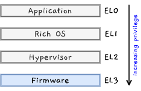
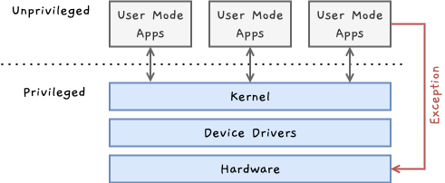

AArch64(혹은 ARM64)는 ARMv8-A에서 쓰이는 ARM의 64비트 인스트럭션 셋 아키텍처입니다. 이번 글에서는 AArch64의 예외 모델(Exception model)에 대해 다룹니다. [^1]

## 권한(Privilege)과 예외 수준(Exception levels)
소프트웨어는 시스템과 프로세서 자원에 대한 여러 접근 권한을 가집니다. 예를 들어, 사용자 어플리케이션은 시스템 구성에 대한 제한된 권한을 가지며, OS 커널은 높은 권한을 가집니다.

AArch64는 다양한 수준의 권한을 가지고 있으며, 현재의 권한 단계는 프로세서가 예외(Exception)를 발생시키거나 반환할 때만 변경되기 때문에 이러한 권한 단계를 예외 수준(Exception Level, EL)이라고 합니다. 각 예외 수준은 고유 번호를 가지며, 번호가 클수록 높은 권한을 가집니다. 

- `EL0`: 사용자 어플리케이션
- `EL1`: 리눅스 커널 등과 같은 운영 체제 커널
- `EL2`: KVM 가상화를 포함한 하이퍼바이저
- `EL3`: 보안 모니터를 포함한 로우 레벨 펌웨어

> 사용자 공간을 포함해 외부에 노출될 수 있는 단말기의 실행 환경을 rich execution environment(REE)라 하고 REE가 제공하는 다양한 어플리케이션 실행과 관리를 위해 많은 기능을 제공하는 운영체제를 Rich Operating System(Rich OS)라고 합니다.

예외 수준은 메모리 권한과 프로세서 자원 접근 권한에 적용됩니다.

### 메모리 권한(Memory Privilege)
Armv8-A는 Memory Management Unit(MMU)이라는 가상 메모리 시스템을 구현하여 소프트웨어가 메모리 영역에 속성(attribute)을 할당할 수 있도록 합니다. 이러한 속성에는 읽기/쓰기 권한도 포함되는데, 권한은 privileged 접근 권한과 unprivileged 접근 권한으로 나뉩니다.

- 프로세서가 EL0에서 실행되는 동안 발생한 메모리 접근에 대해서는 unprivileged 접근 권한을 확인합니다.
- 프로세서가 EL1, EL2, EL3에서 실행되는 동안 발생한 메모리 접근에 대해서는 privileged 접근 권한을 확인합니다.

자세한 내용은 메모리 관리 글에서 다룹니다.

### 레지스터 접근 권한
AArch64의 구성 설정은 시스템 레지스터에 저장됩니다. 시스템 레지스터의 설정 조합은 현재 프로세서의 context를 결정하며, 시스템 레지스터에 대한 접근은 EL로 관리됩니다. 시스템 레지스터의 이름은 해당 레지스터에 접근 가능한 최소 EL을 나타냅니다. 예를 들어  `TTBR0_EL1`은 EL0과 EL1에서 쓰이는 변환 테이블의 베이스 주소를 가지고 있는 레지스터입니다. 해당 레지스터는 EL1 이상에서만 접근 가능하며, EL0에서 접근할 경우 예외가 발생됩니다.

동일한 이름에 EL만 다른 레지스터들은 유사한 일을 수행하지만 독립적이고 인스트럭션에 대한 자체 인코딩을 가지고 있으며, 하드웨어에서 별도로 구현됩니다. 예를 들어, 아래의 레지스터들은 모두 다른 변환 방식에 대한 MMU 구성을 수행합니다.

- `SCTLR_EL1`: EL0, EL1에 대한 시스템 제어
- `SCTLR_EL2`: EL2에 대한 시스템 제어
- `SCTLR_EL3`: EL3에 대한 시스템 제어

> EL0과 EL1은 동일한 MMU 구성을 공유하며 제어는 EL1에서 실행되는 privileged 코드로 제한됩니다. 따라서 `SCTLR_EL0`은 존재하지 않으며 모든 제어는 EL1에서 접근 가능한 레지스터에서 수행됩니다. 다른 제어 레지스터들 또한 기본적으로 이러한 모델을 따릅니다.

높은 예외 레벨은 낮은 예외 레벨에 대한 접근 권한을 가집니다. 예를 들어 필요한 경우 EL2는 `SCTLR_EL1`에 접근 권한을 가집니다. 일반적으로 높은 예외 레벨에서 해당 레벨의 구성에 대해 제어하지만 가상화 기능을 구현하거나 컨텍스트 스위칭 또는 전원 관리 작업 중 저장 및 복원 작업의 일부로 레지스터 셋을 읽고 쓸 때 낮은 수준의 예외 레벨을 가진 레지스터에 접근하기도 합니다.

## 정리

AArch64는 예외 수준을 가지며 지정된 예외 수준에서만 해당 메모리와 레지스터에 접근할 수 있습니다. 요구하는 권한 수준보다 낮은 권한 수준에서 해당 자원에 접근을 시도할 경우에는 예외가 발생합니다. 이어지는 글에서는 AArch64의 실행 상태와 보안 상태에 대해 정리해보겠습니다!

[^1]: [Privilege and Exception levels](https://developer.arm.com/documentation/102412/0100/Privilege-and-Exception-levels) 를 참고하여 작성했습니다.