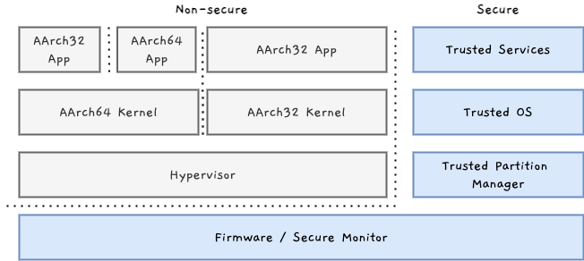
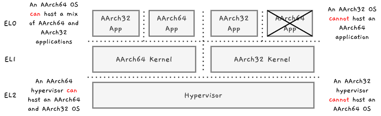

이번 글에서는 AArch64의 실행 상태(Execution states)와 보안 상태(Security states)에 대해 다룹니다. [^1]

## 실행 상태(Execution states)와 보안 상태(Security states)
Armv8-A 프로세서의 현재 상태는 예외 수준(Exception Level)과 실행 상태, 보안 상태에 따라 결정됩니다.

- **실행 상태**는 범용 레지스터와 사용 가능한 인스트럭션 집합을 정의하며 메모리 모델과 예외 관리 방식 또한 실행 상태에 따라 달라집니다.
- **보안 상태**는 현재 유효한 예외 레벨, 현재 접근 가능한 메모리 영역 및 *이러한 접근이 시스템 메모리 버스에서 표시되는 방식*을 제어합니다.

이 다이어그램은 여러 실행 상태가 사용되는 예외 수준 및 보안 상태를 보여 줍니다.

### 실행 상태
Armv8-A는 2개의 가능한 실행 상태를 가집니다.

- `AArch32`: 32bit 실행 상태로 이 상태의 오퍼레이션은 Armv7-A과 호환됩니다. T32, A32 인스트럭션 집합을 사용 가능하며 표준 레지스터는 32bit입니다.
- `AArch64`: 64bit 실행 상태로 A64 인스트럭션 집합만 사용 가능합니다. 표준 레지스터는 64bit입니다.

### 보안 상태
Armv8-A는 2개의 보안 상태를 허용합니다. 이를 통해 소프트웨어를 추가로 파티셔닝하여 신뢰할 수 있는 소프트웨어를 분리할 수 있습니다.
- **Secure[^2] state (Secure world)**: Processing Element(PE)는 secure 물리 주소 공간(physical address space)과 non-secure 물리 주소 공간에 모두 접근 가능합니다. Secure 시스템 레지스터와 non-secure 시스템 레지스터에 접근 가능하지만 이 상태로 실행되는 소프트웨어는 secure 인터럽트만 인식할 수 있습니다.
- **Non-secure state (Normal world)**: PE는 non-secure 물리 주소 공간에만 접근 가능하며 non-secure 접근을 허용한 시스템 레지스터에만 접근 가능합니다. 이 상태로 실행되는 소프트웨어는 Non-secure 인터럽트만 인식할 수 있습니다.

보안 상태의 용도는 TrustZone 글에서 자세히 다룹니다.

### 실행 상태 변경
PE는 초기화 또는 예외 수준이 변경될 때만 실행 상태를 변경할 수 있습니다. 실행 상태 간 이동은 아래의 규칙을 따릅니다.

- 낮은 예외 수준에서 높은 예외 수준으로 이동할 때 실행 상태는 동일하게 유지되거나 `AArch64`로 변경됩니다.
- 높은 예외 수준에서 낮은 예외 수준으로 이동할 때 실행 상태은 동일하게 유지되거나 `AArch32`로 변경됩니다.

이 규칙은 64bit 계층은 32bit 계층을 호스팅할 수 있지만 반대는 불가능하다는 것을 의미합니다. 이는 모든 예외 수준에 적용되며, EL2의 32bit 하이퍼바이저는 EL1의 32bit 가상 머신만 호스트할 수 있습니다.

### 보안 상태 변경
EL3는 항상 secure state에서 실행하는 것으로 간주됩니다. EL3 코드는 `SCR_EL3`를 이용하여 낮은 예외 수준의 보안 상태로 변경할 수 있습니다. 소프트웨어가 `SCR_EL3`를 이용하여 낮은 예외 수준의 보안 상태로 변경하면, PE는 낮은 예외 수준으로 변경되기 전까지 보안 상태를 변경하지 않습니다. ??

## 정리
이번 글에서는 AArch64의 실행 상태와 보안 상태에 대해 정리해보았습니다. 다음 글에서는 AArch64의 예외 유형에 대해 살펴보겠습니다!

[^1]: [Execution and Security states](https://developer.arm.com/documentation/102412/0100/Execution-and-Security-states)를 참고하여 작성했습니다.
[^2]: `secure`, `safe`는 동일하게 "안전한"으로 많이 번역되지만 의미상 차이가 존재합니다. safe는 소프트웨어가 total failure 없이 동작함을 의미하고, secure는 명세 외의 입력(사고 혹은 의도적 침입 등)에 대해 방어함을 의미합니다. 따라서 본 블로그에서는 해당 단어를 번역하지 않고 그대로 사용합니다.