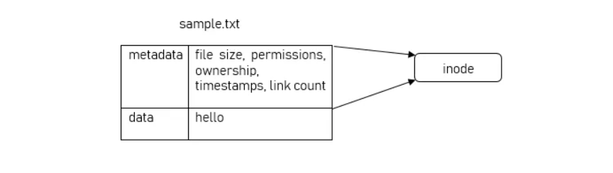
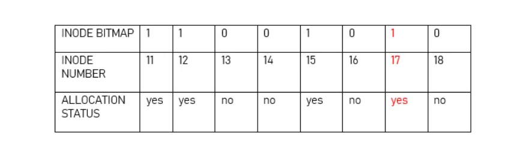
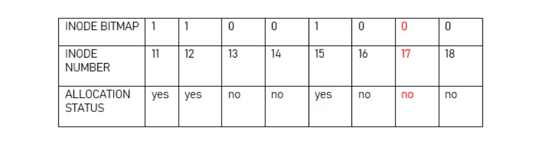

업무 중 링크 파일 수정과 관련한 문제가 발생하여 공부하는 김에 리눅스 파일 시스템의 inode를 정리해보려고 합니다! [^1]

## Metadata
"hello"라는 내용을 담은 `sample.txt` 파일이 존재할 때 이 파일은 파일 크기, 권한, 소유자, 그룹, 생성/접근/수정 정보 등 다양한 정보를 가지고 있습니다. 파일과 관련된 이러한 정보들을 메타데이터(metadata)라고 합니다. 

## File system
하드 드라이브와 같은 저장 장치는 파일을 저장하기 전 파티션이 파일 시스템으로 포맷됩니다. 리눅스 시스템에서 파티션은 주로 EXT4로 포맷됩니다. 그 외 파일 시스템으로는 B-Tree File System(BTRFS), Reiser File System, ZFS 등이 있습니다. (파일 시스템에 대해서는 다른 글에서 자세히 다룰 예정입니다.)

## Inode

Inode는 EXT4에서 파일의 메타데이터를 담고 있는 자료구조입니다. 파일 시스템 내에서 파일이나 디렉토리는 고유한 inode를 가지며 inode 번호를 통해 구분이 가능합니다.

사용자가 파일에 접근할 때 파일명을 사용하지만 내부적으로는 파일 이름이 디렉토리 테이블에 저장된 inode 번호에 매핑되고, 매핑된 inode 번호를 통해 해당 inode에 접근합니다. [^2]

### Inode 번호

파일 시스템에서 inode 번호는 1부터 시작합니다. 첫 10개의 inode는 시스템용으로 예약되어 있고 사용자 파일은 11번째 inode부터 메타데이터를 저장합니다. 모든 inode는 inode 테이블에 저장됩니다.

하나의 inode는 256바이트이며 리눅스에서는 한 파일의 모든 메타데이터를 256바이트에 저장할 수 있습니다. inode의 총 개수는 가용 공간과 파티션에 저장된 파일의 개수에 따라 달라집니다.

### Inode의 할당과 해제
inode의 할당 상태를 확인하기 위한 inode bitmap이라는 자료구조가 존재합니다. 

위 표와 같이 8비트의 inode bitmap에 11번 ~ 18번 inode의 할당 상태를 표시했을 때, 할당된 inode는 bitmap 1 값을 가집니다. bitmap 값이 0이면 해당 inode가 현재 쓰이지 않는다는 것을 의미합니다. 현재 17번 inode는 사용중입니다.

17번 inode에 메타데이터가 저장되어 있는 파일을 지우게 되면 해당 bitmap 값도 0이 되고 다른 파일이 사용할 수 있게 됩니다.

### Inode 조회
파일에 해당하는 inode는 `ls`의 `-i` 옵션으로 조회할 수 있습니다.
```
user@user-Samsung-DeskTop-System:~/inode_test$ ls -ali
합계 12
11575667 drwxrwxr-x  2 user user 4096  6월 17 09:58 .
10747906 drwxr-xr-x 38 user user 4096  6월 17 09:51 ..
11575669 -rw-rw-r--  1 user user    7  6월 17 09:52 original.txt
```
- `11575669`: inode 번호
- `-`: 파일의 유형 ('d'는 디렉토리, '-'는 일반 파일, 'l'은 링크 파일)
- `rw-rw-r--`: 파일 권한
- `1`: 해당 파일의 링크 수 (파일에 대한 하드 링크, 심볼릭 링크는 다음 글에서 자세히 다룰 예정입니다.)
- `user user`: 파일을 소유한 사용자와 그룹
- `7`: 파일의 크기
- `6월 17 09:52`: 최종 수정 일시

## 정리
이번 글에서는 리눅스 파일 시스템에서 사용되는 inode에 대해 알아보았습니다. 다음 글에서는 하드 링크와 심볼릭 링크에 대해 다룰 예정입니다!

[^1]: [How Do Linux Inodes Work?](https://www.maketecheasier.com/how-do-linux-inodes-work/)를 참고하여 작성했습니다.
[^2]: [리눅스 시스템의 아이노드(inode), 심볼릭 링크(Symbolic Link), 하드 링크(Hard Link)](https://koromoon.blogspot.com/2018/05/inode-symbolic-link-hard-link.html)를 참고하여 작성했습니다.