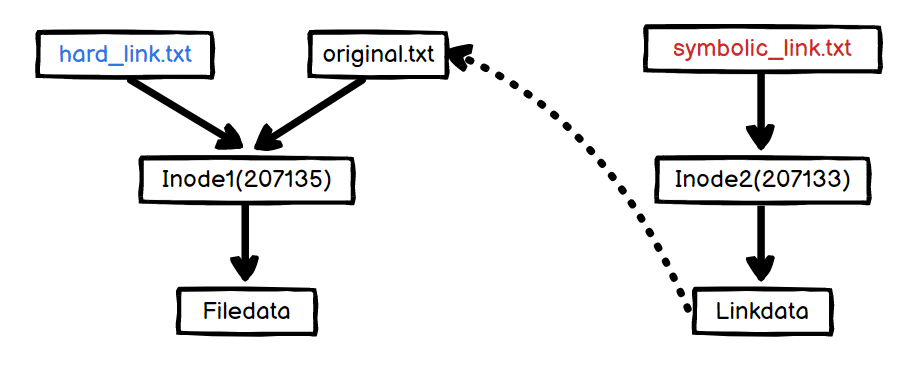

이번 글에서는 심볼릭 링크와 하드 링크에 대해 정리해보겠습니다. 

## 심볼릭 링크 (Symbolic link)
심볼릭 링크(또는 소프트 링크, Soft link)는 윈도우의 바로가기와 비슷한 개념으로 원본 파일과 연결된 파일입니다. 심볼릭 링크는 아래와 같은 상황에서 유용하게 사용됩니다. [^1]
- 파일의 불필요한 반복적 복사를 방지하여 파일 시스템을 활용하는 경우
- 여러 디렉토리에서 동일한 라이브러리를 요구하는 경우
- 같은 파일을 여러 사람이 공통으로 관리하면서 사용하는 경우
- 비슷한 역할을 담당하는 여러가지 파일들 중 하나를 선택하여 대표적으로 사용하는 경우

### 심볼릭 링크 생성하기
심볼릭 링크는 `ln -s` 로 생성할 수 있습니다. 
```bash
ln -s [ORIGINAL] [LINK]
```
`original.txt` 파일을 만들고 해당 파일에 대한 심볼링 링크 `symbolic_link.txt` 를 만들어봅시다!
```bash
user@e578ae40797b:~/inode_test# vim original.txt
user@e578ae40797b:~/inode_test# ln -s original.txt symbolic_link.txt
```
inode를 확인해보면 `original.txt` 와 `symbolic_link.txt` 의 inode 번호가 다른 것을 알 수 있습니다. 원본과 연결된 새로운 파일을 만드는 것이라서 새로운 inode가 생성되기 때문이죠.
```bash
user@e578ae40797b:~/inode_test$ ls -ali
total 12
207131 drwxrwxr-x 2 user user 4096 Jun 19 17:19 .
207103 drwxr-xr-x 4 user user 4096 Jun 19 17:19 ..
207135 -rw-rw-r-- 1 user user   26 Jun 19 17:19 original.txt
207133 lrwxrwxrwx 1 user user   12 Jun 19 17:19 symbolic_link.txt -> original.txt
```
그림으로 살펴보면 아래와 같은 구조입니다.


### 심볼릭 링크 수정하기
```bash
user@e578ae40797b:~/inode_test$ cat original.txt
This is the original file
user@e578ae40797b:~/inode_test$ cat symbolic_link.txt
This is the original file
```
심볼릭 링크는 원본 파일을 가리키고 있기 때문에 두 파일을 조회해보면 내용은 같습니다. 그렇다면 심볼릭 링크 파일을 수정한다면 어떻게 될까요?
```bash
user@e578ae40797b:~/inode_test$ vim symbolic_link.txt
user@e578ae40797b:~/inode_test$ cat symbolic_link.txt
This is the symbolic link file
user@e578ae40797b:~/inode_test$ cat original.txt
This is the symbolic link file
```
`symbolic_link.txt` 를 수정했지만 결국 해당 파일은 원본 파일을 가리키고 있기 때문에 원본 파일이 수정됩니다.

### 심볼릭 링크 삭제하기
심볼릭 링크는 원본과 다른 파일이기 때문에 심볼릭 링크를 삭제하더라도 원본 파일에는 영향을 주지 않습니다. 
```bash
user@e578ae40797b:~/inode_test# rm symbolic_link.txt
user@e578ae40797b:~/inode_test# cat original.txt
This is the original file
```
하지만 원본 파일을 삭제하면 바로가기처럼 심볼릭 링크도 사용할 수 없게 됩니다.
```bash
user@e578ae40797b:~/inode_test# rm original.txt
user@e578ae40797b:~/inode_test# cat symbolic_link.txt
cat: symbolic_link.txt: No such file or directory
```

## 하드 링크 (hard link)
하드 링크는 원본 파일과 동일한 파일이며, 원본 파일이 삭제되더라도 동일한 내용의 파일을 가지고 있으므로 자원을 공유하면서도 데이터를 안전하게 관리하고자 할 때 사용됩니다. [^1] 하드링크는 심볼릭 링크와 달리 디렉토리를 링크할 수 없습니다. [^2]

#### 하드 링크 생성하기
하드 링크는 `ln` 으로 생성할 수 있습니다.
```bash
ln [ORIGINAL] [LINK]
```
`original.txt` 파일을 만들고 해당 파일에 대한 심볼링 링크 `hard_link.txt` 를 만들어봅시다!

```bash
user@e578ae40797b:~/inode_test$ vim original.txt
user@e578ae40797b:~/inode_test$ ln original.txt hard_link.txt
```
하드 링크는 원본 파일과 동일한 파일이기 때문에 동일한 inode를 가지며, 권한, 소유자 등 모든 정보가 같습니다.
```bash
user@e578ae40797b:~/inode_test$ ls -ali
total 16
207131 drwxrwxr-x 2 user user 4096 Jun 19 22:00 .
207103 drwxr-xr-x 4 user user 4096 Jun 19 17:22 ..
207135 -rw-rw-r-- 2 user user   26 Jun 19 17:22 hard_link.txt
207135 -rw-rw-r-- 2 user user   26 Jun 19 17:22 original.txt
```
그림으로 살펴보면 아래와 같은 구조입니다.


### 하드 링크 수정하기
```bash
user@e578ae40797b:~/inode_test# cat original.txt
This is the original file
user@e578ae40797b:~/inode_test# cat hard_link.txt
This is the original file
```
하드 링크는 원본 파일 자체이기 때문에 하드 링크를 수정하면 원본 파일도 수정됩니다.
```bash
user@e578ae40797b:~/inode_test# vim hard_link.txt
user@e578ae40797b:~/inode_test# cat hard_link.txt
This is the hard link file
user@e578ae40797b:~/inode_test# cat original.txt
This is the hard link file
```

### 하드 링크 삭제하기
심볼릭 링크와 달리 하드 링크는 원본 파일을 삭제하더라도 하드 링크가 해당 inode에 대한 정보를 가지고 있기 때문에 그대로 사용할 수 있습니다.
```bash
user@e578ae40797b:~/inode_test# rm original.txt
user@e578ae40797b:~/inode_test# cat hard_link.txt
This is the hard link file
```
마찬가지로 하드 링크를 삭제하더라도 원본 파일은 inode 정보를 가지고 있기 때문에 그대로 사용할 수 있습니다.
```bash
user@e578ae40797b:~/inode_test# rm hard_link.txt
user@e578ae40797b:~/inode_test# cat original.txt
This is the original file
```

## 정리

심볼릭 링크와 하드 링크의 가장 큰 차이는 새로운 inode의 생성 여부이며, 그에 따라 용량, 원본 파일이 삭제되는 경우 접근 가능 여부 등이 달라집니다.

[^1]: [하드링크와 심볼릭 링크의 차이점](http://www.metalpen.net/blog/?p=439) 를 참고하여 작성했습니다.
[^2]: [왜 디렉터리 Hard link를 만들 수 없나요?](https://notes.harues.com/posts/why-hard-link-not-allowed-for-directory/) 에서 이에 대한 자세한 내용을 확인할 수 있습니다.