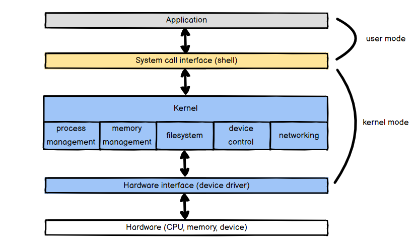
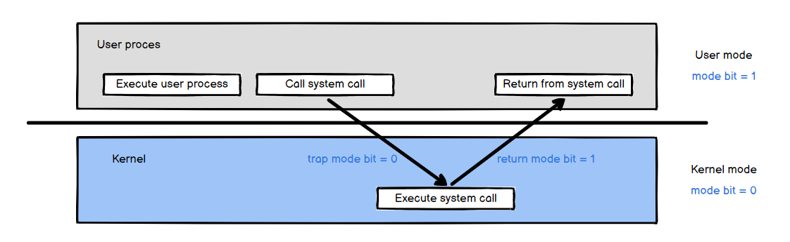
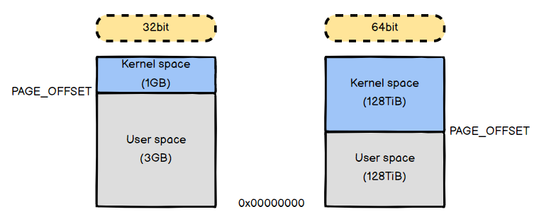
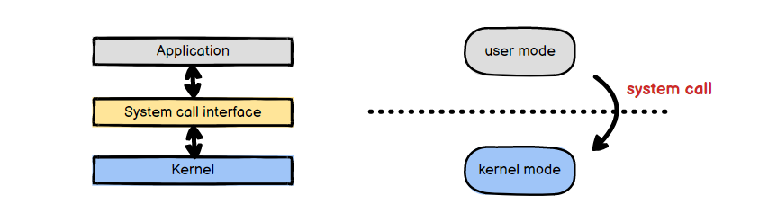
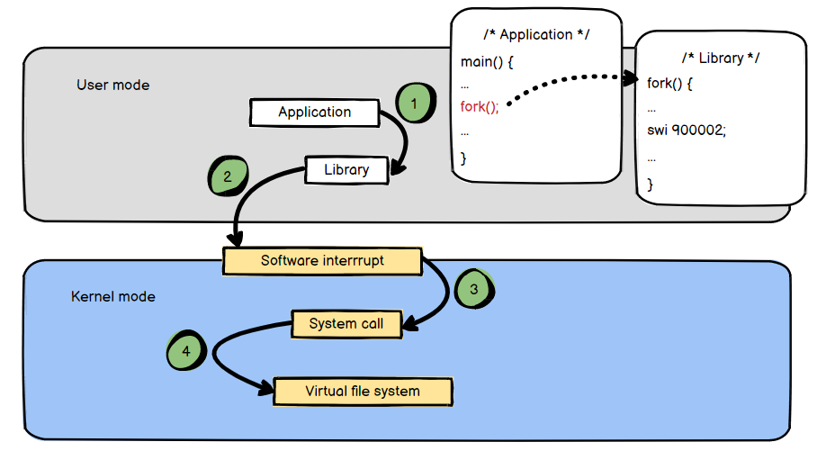
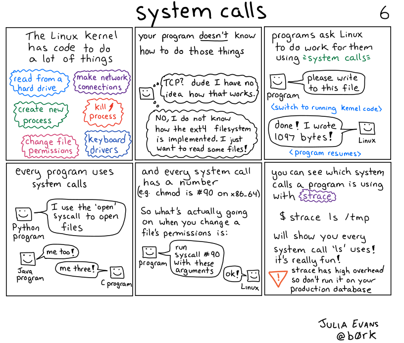

리눅스 시스템은 아래와 같은 구조를 가지는데요, 시스템 콜 인터페이스, 커널, 하드웨어 인터페이스를 순서대로 다룰 예정입니다. 이번 글은 시스템 콜 인터페이스에 대한 내용입니다!

## 이중 동작 모드 (Dual-Mode Operation)
시스템 콜을 이해하려면 이중 동작 모드(Dual-Mode Operation)를 알아야 합니다. 

사용자와 운영체제는 시스템 자원을 공유하기 때문에 사용자에게 제한을 두지 않으면 사용자가 운영체제의 자원을 손상시킬 수 있습니다. 이중 동작 모드는 이러한 위험으로부터 운영체제를 보호하는 기법으로 사용자가 접근할 수 없는 커널 모드(kernel mode)와 사용자가 접근할 수 있는 사용자 모드(user mode)로 나누어집니다. [^1] 커널 모드는 운영체제를 위한 동작을 담당하며 모든 자원(CPU, 메모리, 드라이버 등)에 접근 가능하지만 사용자 모드는 사용자가 접근할 수 있는 영역에 제한을 두어 허용된 영역에만 접근할 수 있습니다.

#### 커널 모드의 특징은 아래와 같습니다.
- `mode bit == 0` 이면 프로세스는 커널 모드로 실행됩니다.
- 모든 메모리에 접근 가능하고 모든 인스트럭션을 수행할 수 있습니다.

#### 사용자 모드의 특징은 아래와 같습니다.
- `mode bit == 1` 이면 프로세스는 사용자 모드로 실행됩니다.
- 어플리케이션 코드를 실행하는 프로세스는 사용자 모드에서 처음 실행됩니다.
- 시스템 자원에 대한 접근이 제한되며 하드웨어에 직접 접근이 불가능합니다.

### 커널 영역(Kernel space, Kernel land)과 사용자 영역(User space, User land)

리눅스의 가상 메모리는 커널 영역과 사용자 영역으로 나뉘는데요, 커널 모드로는 커널 영역과 사용자 영역 모두 접근 가능하지만 사용자 모드로는 사용자 영역에만 접근 가능합니다. 32bit 리눅스에서는 커널 영역이 1GB, 사용자 영역이 3GB 였지만 64bit 리눅스에서는 커널 영역과 사용자 영역 모두 128TiB로 변경되었습니다. [^2] 

## 시스템 콜 (System call)

시스템 콜은 사용자 모드에서 커널 모드로 진입하는 동작입니다. 시스템 계층 관점으로 보면 어플리케이션 계층(사용자 모드)과 커널(커널 모드) 사이에 존재하는 가상 계층 혹은 인터페이스라고 할 수 있습니다.

사용자 모드에서 실행 중인 어플리케이션은 아래와 같은 상황에서 시스템 콜을 발생시킵니다. [^3]
- 파일 시스템에 접근해서 파일을 읽고 쓸 때
- `PID`와 같은 프로세스 정보를 얻을 때
- 시스템 정보를 얻을 때

시스템 콜 호출 과정은 아래와 같습니다.

1. `fork()` 함수를 사용하기 위해 헤더 파일 `<linux>/include/linux/unistd.h`를 포함(include)합니다. 링커는 라이브러리에서 대응하는 함수를 연결합니다.

2. 라이브러리의 `fork()` 함수에는 어셈블리 `swi 900002`가 존재합니다. `swi`는 소프트웨어 인터럽트(software interrupt)를 나타내며, `900002`는 시스템 호출 번호를 나타냅니다. 소프트웨어 인터럽트를 통해 사용자 모드에서 커널 모드로 전환되어 커널 자원에 접근할 수 있게 됩니다.

3. 소프트웨어 인터럽트에 의해 시스템 호출 함수가 호출됩니다.

4. 가상 파일 시스템을 통해 파일, 디렉토리, 디바이스 등의 커널 자원에 하나의 파일처럼 접근할 수 있게 됩니다.

## 정리

시스템 콜은 사용자 모드와 커널 모드를 분리해주는 역할을 합니다. 사용자 모드에서 커널 코드 영역을 오염시키지 못하도록 제한함으로써 시스템의 안정성과 보안을 확보할 수 있습니다.

[^1]: [운영체제 이중 동작 모드](https://neos518.tistory.com/115) 를 참고하여 작성했습니다.
[^2]: [Memory Management](https://sungju.github.io/kernel/internals/memory_management) 를 참고하여 작성했습니다.
[^3]: [[리눅스커널] 시스템 콜 소개](http://rousalome.egloos.com/9985629) 를 참고하여 작성했습니다.