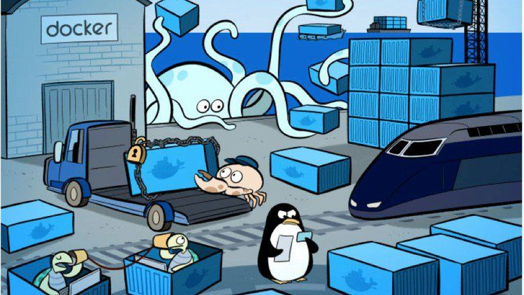
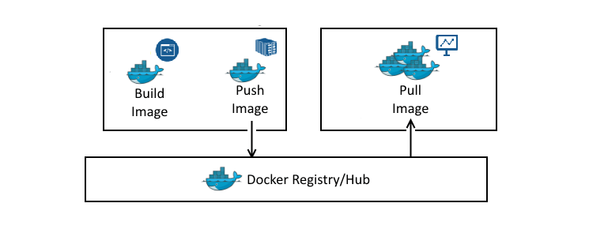
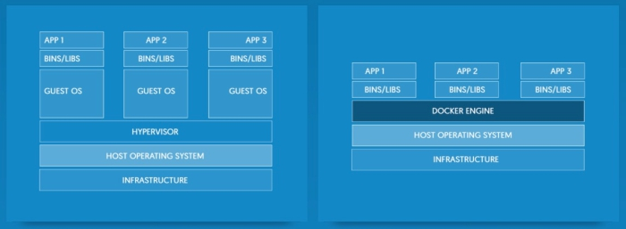

도커(Docker)는 컨테이너 기반의 오픈소스 가상화 플랫폼입니다. 도커를 이용하면 개발, 테스트, 서비스 환경을 통일하여 효율적으로 관리할 수 있습니다.

## 왜 도커를 사용해야 할까요?
서버를 운영하다 보면 운영체제 버전이나 설치된 패키지 버전 등 각 서버간 차이가 발생하게 됩니다. 이렇게 형상이 다른 서버들은 운영 중에 장애를 발생시킬 수 있습니다. [^1]

이러한 문제를 해결하고 각 서버들의 환경을 통일해야 하기 위해 여러 서버에 동시에 접속해서 한꺼번에 명령을 실행하는 도구(tmux-xpanes)나 서버 운영 기록을 코드화하는 도구(Vagrant, Chef, Puppet, Ansible 등)들이 등장합니다. 도커에서 사용하는 도커파일(dockerfile)도 서버 운영 기록을 코드화한 것입니다. **도커 파일**을 빌드하면 **도커 이미지**가 생성되며, 이를 실행하면 **도커 컨테이너(container)** 가 됩니다. 도커 이미지를 이용하면 실행 시점에 상관 없이 항상 동일한 상태로 컨테이너를 실행할 수 있습니다!


## 도커 파일
도커 파일은 DSL(Domain Specific Language)로 작성된 파일로, 컨테이너에 설치해야 하는 패키지, 소스코드, 명령어, 환경변수 설정 등을 기록한 파일입니다. 도커 파일을 빌드하면 도커 이미지가 생성되므로 애플리케이션 빌드와 배포를 자동화할 수 있습니다. 도커 파일의 기본적인 형태는 아래와 같습니다.
```dockerfile
# Dockerfile
FROM node:12-alpine
WORKDIR /app
COPY . .
RUN yarn install --production
CMD ["node", "/app/src/index.js"]
```
 - `FROM`: 이미지를 생성할 때 사용할 Base Image를 지정합니다.
 - `WORKDIR`: 명령(RUN, CMD)을 실행할 디렉토리를 지정합니다.
 - `COPY <src><dest>`: 파일 또는 폴더를 이미지에 복사합니다.
 - `RUN`: 도커 이미지를 빌드할 때 수행합니다.
 - `CMD`: 이미지로부터 컨테이너를 생성하여 최초 실행할 때 수행합니다.

## 도커 이미지
도커 이미지는 도커 파일을 빌드한 것으로 컨테이너 실행에 필요한 파일과 설정값 등을 포함하고 있습니다. 정적인 파일로 상태값을 가지지 않고 변하지 않는 것이 특징입니다. (스냅샷이나 템플릿과 동일한 개념으로 볼 수 있습니다!) 하나의 이미지를 이용해 여러개의 동일한 컨테이너를 생성할 수 있으며, 각 컨테이너 간의 변화는 서로 영향을 끼치지 않습니다.

도커 이전의 컨테이너 기술들에서는 컨테이너의 환경을 완전하고 효율적으로 복원하는 것이 어려웠지만 도커에서는 파일을 계층으로 나눠서 저장하고, 이미지를 다운로드 할 수 있는 `도커 레지스트리`를 제공함으로써 이 문제를 해결했습니다.[^2] 

### 도커의 계층화
#### 도커 이미지와 레이어
도커 이미지는 여러개의 레이어로 구성되어 있으며 각 레이어는 도커 파일의 각각의 인스트럭션을 나타냅니다. 

컨테이너를 생성하면 기존의 레이어들 위에 **컨테이너 레이어**로 불리는 쓰기 가능한(writable) 레이어가 추가됩니다. 실행되고 있는 컨테이너들에 적용되는 변경 사항들(새로운 파일을 만들거나 기존의 파일을 변경/삭제하는 등)은 모두 이 쓰기 가능한 레이어에 저장됩니다. 

#### 도커 컨테이너와 레이어
도커 이미지와 컨테이너의 가장 큰 차이는 쓰기 가능한 최상위 레이어(컨테이너 레이어)입니다. 컨테이너가 삭제되면 이 쓰기 가능한 레이어 또한 삭제되지만, 기본 이미지는 변경되지 않습니다.  

각 컨테이너는 쓰기 가능한 고유의 레이어를 가지기 때문에 여러개의 컨테이너들이 동일한 이미지를 사용하더라도 각각 다른 상태를 가질 수 있게 됩니다.

### 도커 레지스트리

도커 레지스트리(Docker Registry)는 도커 이미지를 저장하고 배포하는 서버입니다. [^3] 도커 레지스트리를 이용하면 이미지가 저장되는 곳과 배포 과정을 관리하고, 이미지 저장과 배포를 통합하여 레지스트리가 포함된 네트워크 망에서 처리할 수 있습니다.
#### Docker Hub
도커 허브([Docker Hub](https://index.docker.io/))는 도커에서 제공하는 공식 이미지 레지스트리입니다. 도커 허브에 올리는 이미지는 누구나 접근 가능합니다.
#### Harbor
기업 내부의 프로젝트나 공개하고 싶지 않은 개인 프로젝트를 진행하는 경우에는 사적인 저장소가 필요합니다. 하버([Harbor](https://goharbor.io/))는 사적인 저장소 중 하나로 Garbage Collection, 도커 이미지 취약점 점검 등의 부가 기능을 추가적으로 제공하여 관리에 용이성을 제공합니다.

## 도커 컨테이너

도커 컨테이너는 도커 이미지 위에서 특정한 프로세스를 격리시켜 실행한 것입니다.  기존의 가상화 방식에서는 서버에 하이퍼바이저(Hypervisor)를 설치한 후 그 위에 가상 운영체제와 애플리케이션을 패키징한 가상 머신(Virtual Machine)을 만들어 실행하는데요, 이 방법은 운영체제가 실행하는 모든 하드웨어의 복제본을 구동해야 하기 때문에 RAM과 CPU가 많이 소모된다는 단점이 있습니다. 반면에 컨테이너는 하나의 OS를 공유하고 라이브러리와 애플리케이션 등의 필요한 자원만 가지고 프로세스를 격리시키기 때문에 가볍고 빠릅니다.

### 도커 컨테이너의 장점
컨테이너는 아래와 같은 장점들이 있습니다.[^4]
- 위에서 언급했듯이 컨테이너는 운영체제를 포함하지 않기 때문에 가상 머신보다 훨씬 크기가 작아서 빠르게 배포가 가능합니다.
- 컨테이너는 어떤 환경에서나 구동이 가능하므로 개발 및 배포가 쉽습니다.
- 운영체제 커널 하나를 공유하기 때문에 운영체제 수준에서 업데이트 또는 패치를 한 번만 수행하면 변경 사항이 모든 컨테이너에 적용됩니다. 이를 통해 효율적으로 서버를 운영하고 관리할 수 있습니다.

## 정리

이번 글에서는 도커의 기본적인 개념과 도커 파일, 이미지, 컨테이너에 대해 알아보았습니다. 다음 글에서는 컨테이너 오케스트레이션에 대해 다룰 예정입니다!


[^1]: [왜 도커를 사용해야 하는가?](https://www.44bits.io/ko/post/why-should-i-use-docker-container)를 참고하여 작성했습니다.
[^2]: [만들면서 이해하는 도커(Docker) 이미지의 구조](https://www.44bits.io/ko/post/how-docker-image-work)를 참고하여 작성했습니다.
[^3]: [Docker Registry](https://docs.docker.com/registry/)를 참고하여 작성했습니다.
[^4]: [[Container 시리즈] 00. Container/ Docker란 뭔가요?](https://tech.osci.kr/2020/03/03/91690167/)를 참고하여 작성했습니다.