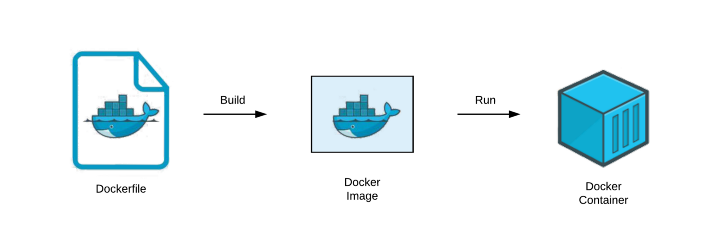

# Docker

도커(Docker)는 컨테이너 기반의 오픈소스 가상화 플랫폼입니다. 

### 왜 도커를 사용해야 할까요?
서버를 운영하다 보면 운영체제 버전이나 설치된 패키지 버전 등 각 서버간 차이가 발생하게 됩니다. 이렇게 형상이 다른 서버들은 운영 중에 장애를 발생시킬 수 있습니다. [^1]

이러한 문제를 해결하고 각 서버들의 환경을 통일해야 하기 위해 여러 서버에 동시에 접속해서 한꺼번에 명령을 실행하는 도구(tmux-xpanes)나 서버 운영 기록을 코드화하는 도구(Vagrant, Chef, Puppet, Ansible 등)들이 등장합니다. 도커에서 사용하는 도커파일(dockerfile)도 서버 운영 기록을 코드화한 것입니다. 도커 파일을 빌드하면 도커 이미지가 생성되며, 이를 실행하면 도커 컨테이너(container)가 됩니다. 도커 이미지를 이용하면 실행 시점에 상관 없이 항상 동일한 상태로 컨테이너를 실행할 수 있습니다!

[^1]: [왜 도커를 사용해야 하는가?](https://www.44bits.io/ko/post/why-should-i-use-docker-container)를 참고하여 작성했습니다.