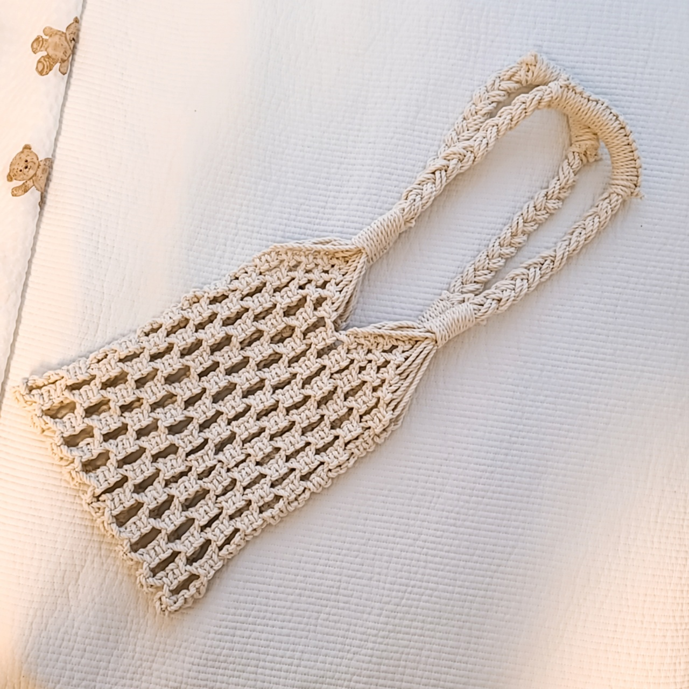

### [마크라메 네트백 만들기 클래스](https://hobbyful.co.kr/product/2dc5b7f1a4) 완강 &#x1f389;&#x1f389;&#x1f389;&#x1f389; 
 

- 일어서서 걸어 놓은 실을 계속 매듭짓다보니 팔, 어깨, 다리 온 몸이 쑤셨다. 보람차고 결과물도 대만족이지만 먼지도 많이 날리고 몸도 아파서 다음부터는 조금 더 편한 취미를 골라야지 &#x1f602;
- 키트에 필요한 준비물이 다 있어서 따로 준비를 하지 않아도 되는 점은 좋았지만 집에 행거가 없다면 불편할 것 같다.
- 나무봉이 가방 몸통에 딱 맞는 길이라 가끔 실이 옆으로 밀리면 빠질 것 같아 불안한 느낌이 있었다. 조금 더 여유있는 길이로 제공되면 좋겠다!
- 면사는 딱 맞는 길이로 제공되어 재단할 때 주의하라고 되어 있었는데 생각보다 많이 남았다 &#x1f609;

- 완성된 가방 &#x1f45c; 가지고 있던 네트백은 조금만 무거운 물건을 넣어도 축 늘어져서 불안했는데 생각보다 엄청 탄탄해서 무거운 물건을 넣어도 늘어짐 없이 유지된다. 장바구니용으로 사용하려고 했는데 너무 예뻐서 일상용으로도 사용해야지 &#x1f636;&#x1f636;