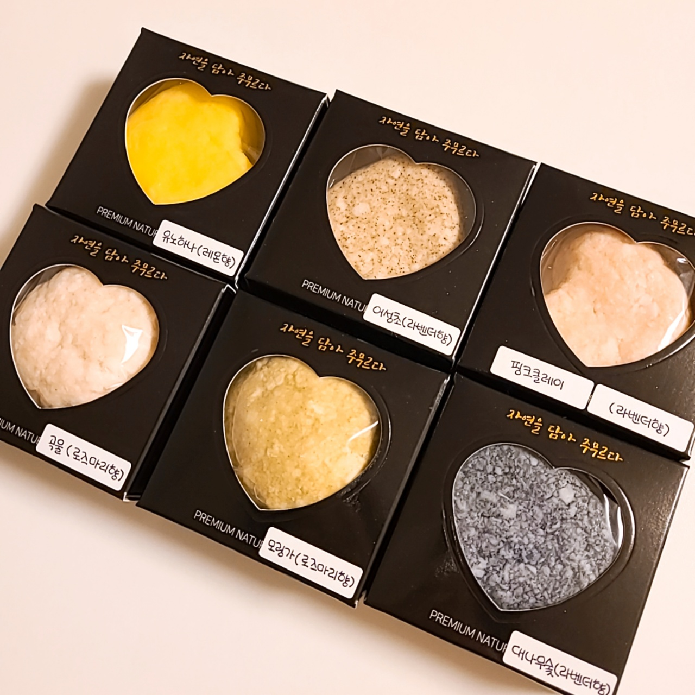

### 천연 수제 비누 만들기 완료 &#x1f389;&#x1f389;&#x1f389;&#x1f389; 

- 가열하지 않아도 되는 간단한 키트를 골랐는데 진짜 간단했다!
- 생각보다 색이 연하게 나와서 아쉬웠다 쨍한 색감이면 더 예쁠 것 같은데 &#x1f625;

- 완성된 비누 &#x1f61a; 포장까지 하니까 진짜 비누 같아서 만족! 주변에도 나눠줘야지 &#x1f636;&#x1f636;
- 사용 후기) 천연 성분이어서 그런지 초반엔 괜찮았는데 쓸수록 거품이 줄어든다.. &#129532; 공방가서 만들었던 건 끝까지 잘 썼는데 역시 차이가 있긴 한가보다!